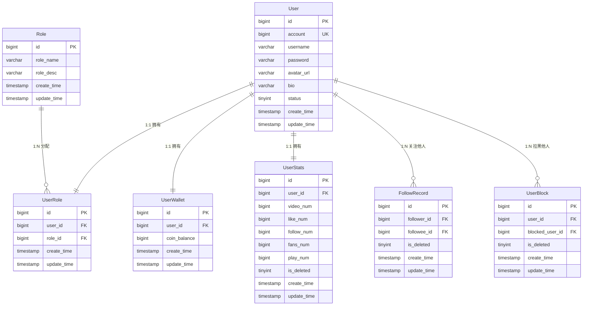
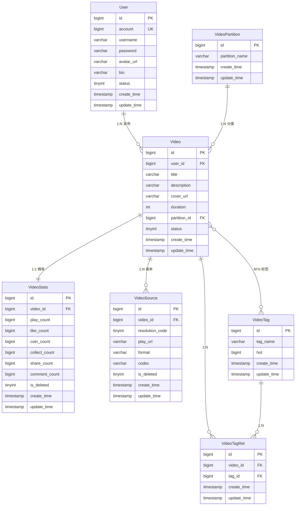
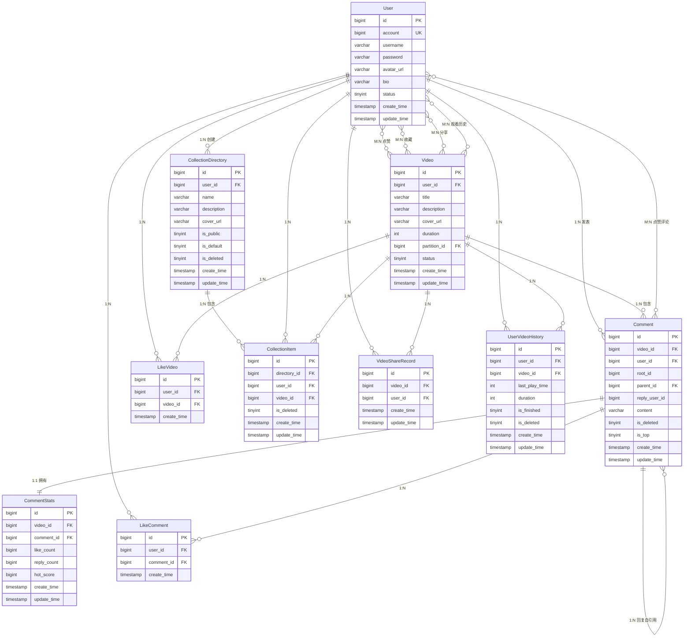
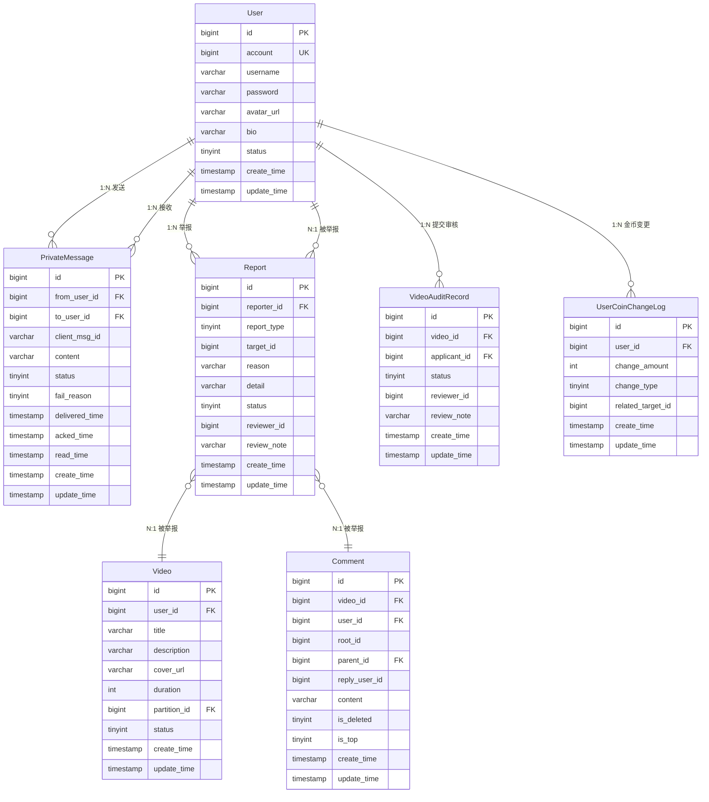

# 毕业项目 E-R 图

---

## 图一：用户与认证模块

| 关系 | 类型 | 说明 |
|---|---|---|
| User ↔ UserRole | 1:1 | uk_user_id 唯一 |
| User ↔ UserWallet | 1:1 | uk_wallet_user_id 唯一 |
| User ↔ UserStats | 1:1 | 隐式一对一 |
| User → FollowRecord | 1:N | follower_id / followee_id |
| User → UserBlock | 1:N | user_id / blocked_user_id |
| Role → UserRole | 1:N | |

---

## 图二：视频与内容模块

| 关系 | 类型 | 说明 |
|---|---|---|
| User → Video | 1:N | |
| VideoPartition → Video | 1:N | |
| Video ↔ VideoStats | 1:1 | |
| Video → VideoSource | 1:N | 多清晰度文件 |
| Video ↔ VideoTag | M:N | 通过 VideoTagRel, uk_video_tag |

---

## 图三：社交互动模块

| 中间表 | 拆解关系 |
|---|---|
| **LikeVideo** | User 1:N LikeVideo, Video 1:N LikeVideo → User ↔ Video M:N |
| **LikeComment** | User 1:N LikeComment, Comment 1:N LikeComment → User ↔ Comment M:N |
| **CollectionItem** | User 1:N CollectionItem, Video 1:N CollectionItem, CollectionDirectory 1:N CollectionItem → User ↔ Video M:N（挂在收藏夹下） |
| **VideoShareRecord** | User 1:N VideoShareRecord, Video 1:N VideoShareRecord → User ↔ Video M:N（uk_video_user_share 去重） |
| **UserVideoHistory** | User 1:N UserVideoHistory, Video 1:N UserVideoHistory → User ↔ Video M:N |

| 其他关系 | 类型 | 说明 |
|---|---|---|
| User → Comment | 1:N | |
| Video → Comment | 1:N | |
| Comment ↔ CommentStats | 1:1 | |
| Comment → Comment（自引用） | 1:N | parent_id，两级嵌套 |
| User → CollectionDirectory | 1:N | |
| CollectionDirectory → CollectionItem | 1:N | |

---

## 图四：管理与审核模块

| 关系 | 类型 | 说明 |
|---|---|---|
| User → PrivateMessage（发送） | 1:N | from_user_id |
| User → PrivateMessage（接收） | 1:N | to_user_id |
| User → Report | 1:N | reporter_id |
| User → VideoAuditRecord | 1:N | applicant_id |
| User → UserCoinChangeLog | 1:N | |
| Report → User/Video/Comment | N:1 | 多态关联，report_type(1/2/3) + target_id |
