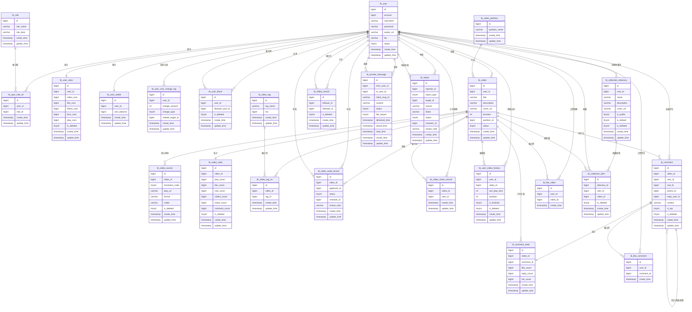

# 系统整体 E-R 图

```mermaid
erDiagram
    %% ==================== 用户与权限模块 ====================
    tb_user {
        bigint id 
        bigint account 
        varchar username 
        varchar password 
        varchar avatar_url 
        varchar bio 
        tinyint status 
        timestamp create_time 
        timestamp update_time 
    }

    tb_role {
        bigint id 
        varchar role_name 
        varchar role_desc 
        timestamp create_time 
        timestamp update_time 
    }

    tb_user_role_rel {
        bigint id 
        bigint user_id 
        bigint role_id 
        timestamp create_time 
        timestamp update_time 
    }

    tb_user_stats {
        bigint id 
        bigint user_id 
        bigint video_num 
        bigint like_num 
        bigint follow_num 
        bigint fans_num 
        bigint play_num 
        tinyint is_deleted 
        timestamp create_time 
        timestamp update_time 
    }

    tb_user_wallet {
        bigint id 
        bigint user_id 
        bigint coin_balance 
        timestamp create_time 
        timestamp update_time 
    }

    tb_user_coin_change_log {
        bigint id 
        bigint user_id 
        int change_amount 
        tinyint change_type 
        bigint related_target_id 
        timestamp create_time 
        timestamp update_time 
    }

    tb_user_block {
        bigint id 
        bigint user_id 
        bigint blocked_user_id 
        tinyint is_deleted 
        timestamp create_time 
        timestamp update_time 
    }

    %% ==================== 视频与内容模块 ====================
    tb_video_partition {
        bigint id 
        varchar partition_name 
        timestamp create_time 
        timestamp update_time 
    }

    tb_video {
        bigint id 
        bigint user_id 
        varchar title 
        varchar description 
        varchar cover_url 
        int duration 
        bigint partition_id 
        tinyint status 
        timestamp create_time 
        timestamp update_time 
    }

    tb_video_source {
        bigint id 
        bigint video_id 
        tinyint resolution_code 
        varchar play_url 
        varchar format 
        varchar codec 
        tinyint is_deleted 
        timestamp create_time 
        timestamp update_time 
    }

    tb_video_stats {
        bigint id 
        bigint video_id 
        bigint play_count 
        bigint like_count 
        bigint coin_count 
        bigint collect_count 
        bigint share_count 
        bigint comment_count 
        tinyint is_deleted 
        timestamp create_time 
        timestamp update_time 
    }

    tb_video_tag {
        bigint id 
        varchar tag_name 
        bigint hot 
        timestamp create_time 
        timestamp update_time 
    }

    tb_video_tag_rel {
        bigint id 
        bigint video_id 
        bigint tag_id 
        timestamp create_time 
        timestamp update_time 
    }

    tb_video_audit_record {
        bigint id 
        bigint video_id 
        bigint applicant_id 
        tinyint status 
        bigint reviewer_id 
        varchar review_note 
        timestamp create_time 
        timestamp update_time 
    }

    tb_video_share_record {
        bigint id 
        bigint video_id 
        bigint user_id 
        timestamp create_time 
        timestamp update_time 
    }

    tb_user_video_history {
        bigint id 
        bigint user_id 
        bigint video_id 
        int last_play_time 
        int duration 
        tinyint is_finished 
        tinyint is_deleted 
        timestamp create_time 
        timestamp update_time 
    }

    %% ==================== 评论模块 ====================
    tb_comment {
        bigint id 
        bigint video_id 
        bigint user_id 
        bigint root_id 
        bigint parent_id 
        bigint reply_user_id 
        varchar content 
        tinyint is_top 
        tinyint is_deleted 
        timestamp create_time 
        timestamp update_time 
    }

    tb_comment_stats {
        bigint id 
        bigint video_id 
        bigint comment_id 
        bigint like_count 
        bigint reply_count 
        bigint hot_score 
        timestamp create_time 
        timestamp update_time 
    }

    tb_like_comment {
        bigint id 
        bigint user_id 
        bigint comment_id 
        timestamp create_time 
    }

    %% ==================== 社交互动模块 ====================
    tb_like_video {
        bigint id 
        bigint user_id 
        bigint video_id 
        timestamp create_time 
    }

    tb_follow_record {
        bigint id 
        bigint follower_id 
        bigint followee_id 
        tinyint is_deleted 
        timestamp create_time 
        timestamp update_time 
    }

    %% ==================== 收藏模块 ====================
    tb_collection_directory {
        bigint id 
        bigint user_id 
        varchar name 
        varchar description 
        varchar cover_url 
        tinyint is_public 
        tinyint is_default 
        tinyint is_deleted 
        timestamp create_time 
        timestamp update_time 
    }

    tb_collection_item {
        bigint id 
        bigint directory_id 
        bigint user_id 
        bigint video_id 
        tinyint is_deleted 
        timestamp create_time 
        timestamp update_time 
    }

    %% ==================== 私信模块 ====================
    tb_private_message {
        bigint id 
        bigint from_user_id 
        bigint to_user_id 
        varchar client_msg_id 
        varchar content 
        tinyint status 
        tinyint fail_reason 
        timestamp delivered_time 
        timestamp acked_time 
        timestamp read_time 
        timestamp create_time 
        timestamp update_time 
    }

    %% ==================== 举报模块 ====================
    tb_report {
        bigint id 
        bigint reporter_id 
        tinyint report_type 
        bigint target_id 
        varchar reason 
        varchar detail 
        tinyint status 
        bigint reviewer_id 
        varchar review_note 
        timestamp create_time 
        timestamp update_time 
    }

    %% ==================== 实体关系 ====================

    %% --- 用户-角色 (多对多) ---
    tb_user ||--o{ tb_user_role_rel : "拥有"
    tb_role ||--o{ tb_user_role_rel : "被分配"

    %% --- 用户-统计 (一对一) ---
    tb_user ||--|| tb_user_stats : "统计"

    %% --- 用户-钱包 (一对一) ---
    tb_user ||--|| tb_user_wallet : "钱包"

    %% --- 用户-硬币流水 (一对多) ---
    tb_user ||--o{ tb_user_coin_change_log : "变更记录"

    %% --- 用户-拉黑 (自引用多对多) ---
    tb_user ||--o{ tb_user_block : "拉黑"
    tb_user ||--o{ tb_user_block : "被拉黑"

    %% --- 用户-视频 (一对多) ---
    tb_user ||--o{ tb_video : "投稿"

    %% --- 分区-视频 (一对多) ---
    tb_video_partition ||--o{ tb_video : "包含"

    %% --- 视频-视频源 (一对多) ---
    tb_video ||--o{ tb_video_source : "多分辨率"

    %% --- 视频-视频统计 (一对一) ---
    tb_video ||--|| tb_video_stats : "统计"

    %% --- 视频-标签 (多对多) ---
    tb_video ||--o{ tb_video_tag_rel : "打标签"
    tb_video_tag ||--o{ tb_video_tag_rel : "被引用"

    %% --- 视频-审核记录 (一对多) ---
    tb_video ||--o{ tb_video_audit_record : "审核"
    tb_user ||--o{ tb_video_audit_record : "申请"
    tb_user ||--o{ tb_video_audit_record : "审核"

    %% --- 视频点赞 (用户-视频 多对多) ---
    tb_user ||--o{ tb_like_video : "点赞视频"
    tb_video ||--o{ tb_like_video : "被点赞"

    %% --- 视频分享 (用户-视频 多对多去重) ---
    tb_user ||--o{ tb_video_share_record : "分享视频"
    tb_video ||--o{ tb_video_share_record : "被分享"

    %% --- 观看历史 (用户-视频 多对多) ---
    tb_user ||--o{ tb_user_video_history : "观看记录"
    tb_video ||--o{ tb_user_video_history : "被观看"

    %% --- 评论 (用户-视频-评论 两级嵌套) ---
    tb_user ||--o{ tb_comment : "发表评论"
    tb_video ||--o{ tb_comment : "有评论"
    tb_comment ||--o{ tb_comment : "回复(两级嵌套)"

    %% --- 评论统计 ---
    tb_comment ||--|| tb_comment_stats : "统计"
    tb_video ||--o{ tb_comment_stats : "冗余关联"

    %% --- 评论点赞 ---
    tb_user ||--o{ tb_like_comment : "点赞评论"
    tb_comment ||--o{ tb_like_comment : "被点赞"

    %% --- 关注 (用户自引用多对多) ---
    tb_user ||--o{ tb_follow_record : "关注"
    tb_user ||--o{ tb_follow_record : "被关注"

    %% --- 收藏夹 ---
    tb_user ||--o{ tb_collection_directory : "创建收藏夹"
    tb_collection_directory ||--o{ tb_collection_item : "收藏视频"
    tb_user ||--o{ tb_collection_item : "收藏"
    tb_video ||--o{ tb_collection_item : "被收藏"

    %% --- 私信 (用户自引用) ---
    tb_user ||--o{ tb_private_message : "发送"
    tb_user ||--o{ tb_private_message : "接收"

    %% --- 举报 (多态目标) ---
    tb_user ||--o{ tb_report : "举报"
    tb_user ||--o{ tb_report : "审核举报"
```
